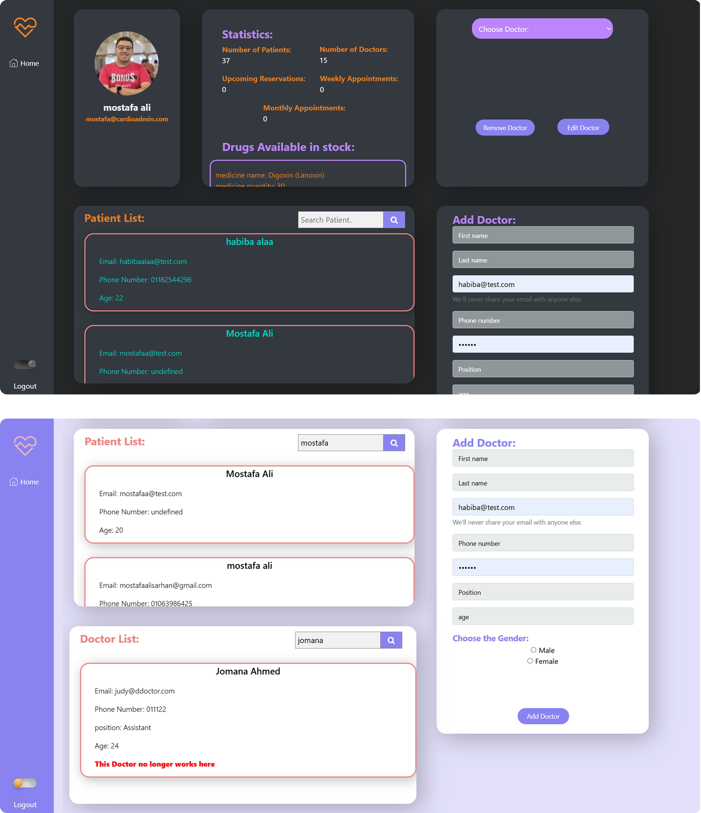

# Cardio - Hospital Information System Web Application

## Overview
This project is a web application designed to simulate a **Hospital Information System (HIS)** for the **Cardiology Department**. The system allows different user categories, such as **Doctors, Patients, and Administrators**, to access relevant functionalities. The project is built using:

- **Backend:** Node.js, Express.js
- **Frontend:** HTML, CSS, Bootstrap
- **Database:** PostgreSQL

## Features
### Core Functionalities
- **Home Page:** Landing page for visitors with an overview of the hospital system.
<!--  -->

- **User Management:** Secure registration and login for different user types (Doctors, Patients, Admins, etc.)

- **Profile Management:** Each user has a personal profile (e.g., doctor profiles, patient medical history).
  
  https://github.com/user-attachments/assets/ee70cbdf-141c-40db-b80c-748427e78fbf
  
- **File Handling:** Upload and serve static files (e.g., patient scans and reports).
  
  https://github.com/user-attachments/assets/9e61f93c-f62a-4255-8381-5288884b8d1c
- **Appointments System:** Patients can book appointments with doctors.
- 
  https://github.com/user-attachments/assets/97a63305-82bb-4f77-94fe-38b819de7fab
  
- **Admin Dashboard:** Statistical analysis dashboard for administrators. the admins can access the database of the doctors and the patients, can edit and add a new doctor, also he can access edit the medications quantities in the stock. also he is the only ine who can add a new doctors to the system.

- **doctor patient communication:** the doctor and the patients can reach each others by the chatting system provided in the profile of each one of them. the user choses the name of the doctor and send him a message and vice versa.
  
  https://github.com/user-attachments/assets/2101acca-4689-4122-88a8-93a680a583eb
  
### New Feature: Medication Billing System
- **Medication Stock Database:** Tracks available medications in the hospital's inventory.
- **Billing System:** Allows doctors and pharmacists to generate bills for prescribed medications.
- **Invoice Generation:** Generates printable bills for patients purchasing medications.
- **Stock Management:** Updates inventory after medication sales.
- **Integration with Patient Records:** Links prescribed medications to patient profiles.
- **email updates:** the bills once created can be sent to the patient email directly.

## Installation & Setup
### Prerequisites
Ensure you have the following installed:
- Node.js
- PostgreSQL
- Git

### Steps to Run the Project
1. Clone the repository:
   ```bash
   git clone https://github.com/Mostafaali3/Cardio_HIS_FinalProject
   ```
1. Open the project in your editor and access the backend folder:
   ```bash
   cd backend
   ```
2. Install dependencies:
   ```bash
   npm install
   ```
<!-- 3. Configure database settings in `.env`:
   ```plaintext
   DB_HOST=your_database_host
   DB_USER=your_database_user
   DB_PASSWORD=your_database_password
   DB_NAME=your_database_name
   ``` -->
<!-- 3. Initialize the database:
   ```bash
   npm run run:dev
   ``` -->
3. Start the application:
   ```bash
   npm run run:dev
   ```
4. Access the application in the browser at `localhost:4000/homePage`

---

## Team Members
<div align="center">
  <table style="border-collapse: collapse; border: none;">
    <tr>
      <td align="center" style="border: none;">
        <br>
        <a href="https://github.com/Mostafaali3"><b>Mostafa Ali</b></a>
      </td>
      <td align="center" style="border: none;">
        <br>
        <a href="https://github.com/habibaalaa123"><b>Habiba Alaa</b></a>
      </td>
      <td align="center" style="border: none;">
        <br>
        <a href="https://github.com/Youssef-Abo-El-Ela"><b>Youssef-Abo-El-Ela</b></a>
      </td>
      </td>
      <td align="center" style="border: none;">
        <br>
        <a href="https://github.com/JudyEssam"><b>Judy Essam</b></a>
      </td>
    <td align="center" style="border: none;">
        <br>
        <a href="https://github.com/Mayamohamed207"><b>Maya mohamed</b></a>
      </td>
  </table>
</div>


---


<!-- ## Screenshots & Videos
### Screenshots
(Insert screenshots of the website here)

### Video Demonstration
(Insert link to a demo video here)

## Contributing
1. Fork the repository
2. Create a new feature branch (`git checkout -b feature-name`)
3. Commit your changes (`git commit -m 'Add new feature'`)
4. Push to the branch (`git push origin feature-name`)
5. Open a Pull Request

## License
This project is licensed under the MIT License. -->

## Contact
For any inquiries, reach out via [mostafaalisarhan@gmail.com](mailto:mostafaalisarhan@gmail.com).

